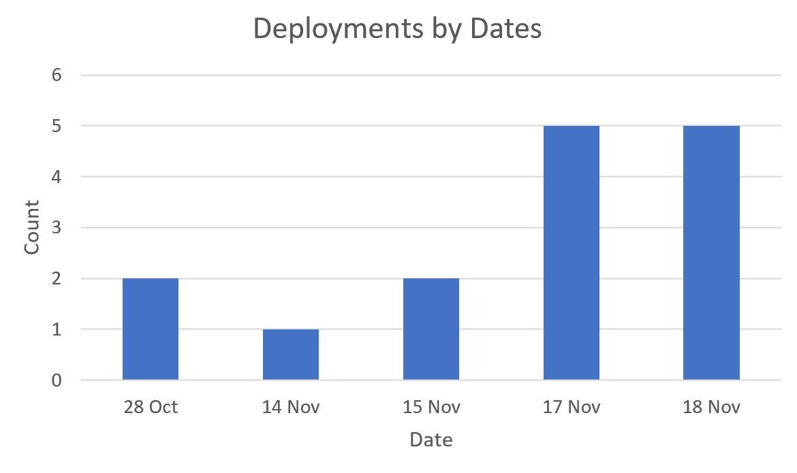
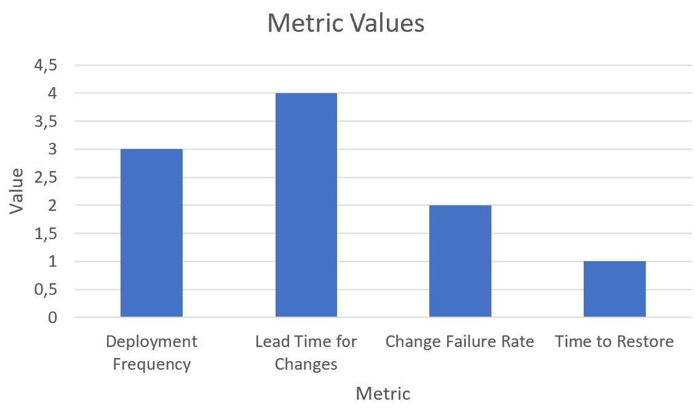

#Розрахунок та аналіз DORA-метрик

##DORA-метрики

| Metric                | Result    | Category |
| --------------------- | --------- | -------- |
| Deployment Frequency  | 2 deploys | High     |
| Lead Time for Changes | 1 minute  | Elite    |
| Change Failure Rate   | 33%       | Medium   |
| Time to Restore       | 3 weeks   | Low      |

##Графіки

###Розгортання по датах

###Тривалість розгортань

###Значення метрик

##Аналітичний розділ
#####Deployment Frequency (Частота деплоїв)
Проєкт здійснює ~2 деплоя на тиждень, що відповідає категорії High. Це свідчить про регулярну інтеграцію змін у production, що позитивно впливає на швидкість доставки функціоналу.

#####Lead Time for Changes (Час доставки змін)
Середній час від коміту до деплою становить близько 1 хвилини, що відповідає категорії Elite. Це вказує на високу автоматизацію процесів CI/CD і мінімальні затримки між розробкою та релізом.

#####Change Failure Rate (Частка провальних змін)
Метрика складає 33%, що відповідає категорії Medium. Це означає, що близько третини змін потребують додаткового втручання або виправлень після релізу. Тестування та контроль якості було поліпшено в останні тижні роботи, а тому CFR піднялась до 100% за останні 3 тижні.

#####Time to Restore Service (Час відновлення)
Середній час відновлення становить 3 тижні, що відповідає категорії Low. Це вказує на серйозну проблему з реакцією на інциденти та баги.
