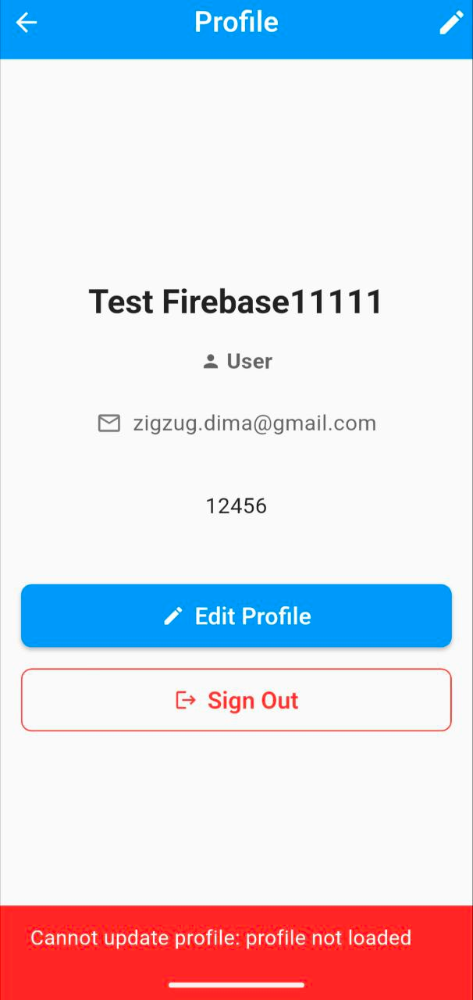
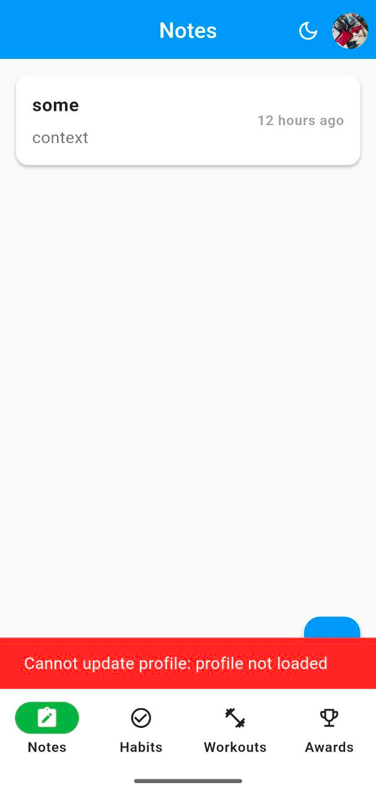

# Debugging Log: Avatar Update Race Condition

---

## Симптом (Symptom)

### Що пішло не так

При одночасній зміні аватарки та профільної інформації (ім'я або біо) виникала помилка **"Cannot update profile: profile not loaded"**:

1. Користувач обирає нову аватарку
2. Користувач змінює ім'я або біо
3. Натискає "Save"
4. Система показує помилку замість збереження змін

**Важливо:** Баг виникав тільки коли змінювались **обидва** параметри одночасно (аватарка + ім'я/біо). При зміні тільки аватарки або тільки ім'я/біо - все працювало коректно.

### Скріншот помилки





### Демонстрація бага


**Помилка:**
```
Error: Cannot update profile: profile not loaded
Location: profile_bloc.dart:69
```

---

## Корінна причина (Root Cause)

### Аналіз проблеми

Проблема виникала через **race condition** (стан гонки) у `edit_profile_page.dart` методі `_handleSave()`.

### Чому це сталося

У методі `_handleSave()` викликались два events одночасно без координації:
1. `UploadAvatar` - для завантаження нової аватарки
2. `UpdateProfile` - для оновлення імені/біо (якщо вони також змінювались)

**Проблема:**
- Коли `UploadAvatar` починав виконуватись, він змінював state на `AvatarUploading`
- `UpdateProfile` намагався виконатись одразу після цього
- У `profile_bloc.dart:45` метод `_onUpdateProfile` перевіряв чи state є одним із дозволених (`ProfileLoaded`, `ProfileUpdateSuccess`, `AvatarUploadSuccess`)
- Але НЕ перевіряв `AvatarUploading` - тому викидалась помилка "profile not loaded"

### Діаграма проблеми

```
User clicks Save
    │
    ├──> UploadAvatar event added
    │         │
    │         └──> State: AvatarUploading
    │
    └──> UpdateProfile event added (одразу!)
              │
              └──> Check: is state valid?
                        │
                        └──> NO! State is AvatarUploading
                              │
                              └──> Error: "profile not loaded"
```

---

## Виправлення (Fix)

### Стратегія вирішення

Замість виклику двох operations одночасно, реалізовано **послідовне виконання**:
1. Спочатку завершується upload аватарки
2. Потім (якщо потрібно) виконується оновлення профілю
3. Після завершення всіх операцій оновлюється `AuthBloc`

### Зміни в коді

#### 1. Додано флаг для відстеження послідовності операцій
**Файл:** `edit_profile_page.dart`

Додано змінну `_shouldUpdateProfileAfterAvatar` у state класі для координації послідовного виконання operations.

#### 2. Змінено логіку `_handleSave()`
**Файл:** `edit_profile_page.dart` (рядки 99-139)

Тепер метод перевіряє чи потрібно оновлювати і аватарку, і профіль одночасно:
- Якщо так - спочатку завантажується аватарка, потім (через listener) оновлюється профіль
- Якщо тільки аватарка - виконується тільки `UploadAvatar`
- Якщо тільки ім'я/біо - виконується тільки `UpdateProfile`

#### 3. Оновлено BlocListener для послідовного виконання
**Файл:** `edit_profile_page.dart` (рядки 145-179)

Listener тепер:
- Відстежує успішне завантаження аватарки (`AvatarUploadSuccess`)
- Якщо флаг `_shouldUpdateProfileAfterAvatar` встановлений - запускає `UpdateProfile`
- Після завершення всіх операцій оновлює `AuthBloc` і закриває сторінку

#### 4. Додано синхронізацію з AuthBloc

**Додатковий баг:** Аватарка на головній сторінці не оновлювалась після збереження, бо `main_navigation.dart` використовував `AuthBloc`, який не знав про зміни.

**Виправлення:**
- Новий event `UserProfileUpdated` у `auth_event.dart`
- Новий handler `_onUserProfileUpdated` у `auth_bloc.dart`, що оновлює state з новими даними користувача

### Діаграма виправлення

```
User clicks Save
    │
    ├──> Has avatar + profile changes?
    │         │
    │         └──> YES
    │               │
    │               ├──> Set flag: _shouldUpdateProfileAfterAvatar = true
    │               │
    │               └──> UploadAvatar event
    │                         │
    │                         └──> State: AvatarUploading
    │                               │
    │                               └──> Avatar uploaded
    │                                     │
    │                                     └──> State: AvatarUploadSuccess
    │                                           │
    │                                           └──> Listener detects flag
    │                                                 │
    │                                                 └──> UpdateProfile event
    │                                                       │
    │                                                       └──> State: ProfileUpdating
    │                                                             │
    │                                                             └──> Profile updated
    │                                                                   │
    │                                                                   └──> Update AuthBloc
    │                                                                         │
    │                                                                         └──> Success!
```

### Змінені файли

1. `lib/features/profile/presentation/pages/edit_profile_page.dart`
2. `lib/features/auth/presentation/bloc/auth_event.dart`
3. `lib/features/auth/presentation/bloc/auth_bloc.dart`

---

## Урок (Lessons Learned)

### Що зробити інакше в майбутньому

1. **Уникати паралельних асинхронних операцій без координації**
   - Завжди планувати порядок виконання async операцій
   - Використовувати flags, callbacks або async/await для координації

2. **Перевіряти всі можливі states у BLoC**
   - У перевірках state включати не лише "завершені" стани, але й "в процесі"
   - Або використовувати інший підхід до координації операцій

3. **Синхронізувати стан між різними BLoCs**
   - Якщо дані користувача зберігаються у кількох BLoCs (AuthBloc, ProfileBloc), потрібен механізм синхронізації
   - Розглянути централізований стан або event bus для критичних даних

4. **Писати інтеграційні тести для складних сценаріїв**
   - Unit тести могли не виявити цю проблему
   - Потрібен тест що перевіряє одночасну зміну аватарки та профілю

5. **Логувати state transitions під час розробки**
   - Додати детальне логування переходів між states у BLoC
   - Це допомогло б швидше виявити race condition

### Рекомендації для команди

- **Code Review:** Звертати увагу на паралельні виклики асинхронних операцій
- **Testing Strategy:** Додати тести для сценаріїв з множинними одночасними змінами
- **Architecture:** Розглянути використання middleware або interceptors для координації складних операцій
- **Documentation:** Документувати порядок виконання в методах з множинними async операціями

### Метрики

- **Час виявлення:** ~30 хвилин (аналіз коду та відтворення)
- **Час виправлення:** ~45 хвилин (реалізація + тестування)
- **Кількість змінених файлів:** 3
- **Кількість доданих рядків коду:** ~60
- **Складність виправлення:** Низька (потребувала рефакторингу логіки)
